# ShortFilmBuilder

Turn a written story into a narrated, animated short film. You direct and approve; an AI coding
agent plans, paints and cuts; deterministic scripts do the paid work; Remotion renders the film.

<!-- hero: 6-second GIF of the showcase film, linking to the full film -->

*Alice in Dragonland*, 4:17, made from a fourth-grader's short story: 41 shots, 5 voices,
one composed score, about $45 of generated media. **[Watch it](https://www.youtube.com/watch?v=REPLACE_ME)**.

## What you do, what the agent does

| You | The agent | The scripts |
|---|---|---|
| Hand over the story | Casts it, writes the beat sheet, picks the voices | Record one continuous voice take |
| Listen to the take, approve the runtime | Plans every shot against the measured narration | Measure where each sentence is spoken |
| Approve the character sheets and plates | Paints them, audits them for continuity | Generate the clips, cache and archive every take |
| Look at the contact strips | Re-rolls what failed, fixes the plate when the plate is the cause | Verify sync and picture on the rendered file |
| Watch the film | Adds title, credits and music | Render |

Nothing is generated until you have approved the plan for it, and nothing is called finished
until the checks pass on the actual file.

## Quick start

1. **Set up** — follow [SETUP.md](SETUP.md): three accounts, one `.env` file, then
   `npx tsx scripts/doctor.ts` until every line is green. About thirty minutes.
2. **Open the repo in [Claude Code](https://claude.com/claude-code)** and run
   `/story-film path/to/your-story.md`. Other agents (Codex, Cursor, Gemini CLI) work from
   [AGENTS.md](AGENTS.md) and the [pipeline guide](docs/animated-story-pipeline.md).
3. **Say yes at each gate.** Twelve stages, each ending with something to look at or listen to.

If you would rather point your agent at this repo and say *"set this up and make a film from
my story"*, that works too. It will read the same files you would.

## What it costs

List prices for a four-minute film with about forty shots, from the
[retrospective](shows/alice-in-dragonland/retrospective.md) of the film above:

| | |
|---|---|
| Google Veo 3.1 Lite clips, including a third re-rolled | ~$30 |
| Gemini illustrations, ~80 generations | ~$10 |
| ElevenLabs voices, alignment, music | ~$2 |
| **Media** | **~$45, about $12 per finished minute** |
| Coding agent | your existing subscription |

New Google Cloud accounts come with free credit that covers several films.

## What is in the box

- **A twelve-stage workflow with gates** (`.claude/skills/story-film`), written from the
  mistakes of the first film so you do not repeat them.
- **The shot-prompting craft** for image-to-video models (`.claude/skills/video-shot-prompts`):
  one action and one camera move per clip, constraints not description, what a first frame
  can and cannot be told to forget.
- **Audio-first timing.** The recording is the timeline. Shots are cut to sentences measured
  from the mp3 by forced alignment, never to guessed seconds.
- **A data-driven engine.** A film is one JSON file (`shows/<slug>/film.json`): parts, shots,
  cards, credits, music. Remotion compositions are generated from it.
- **Checks that run on the rendered file**: cuts against speech onsets, black frames, clip
  retime bounds, music placement.
- **A complete worked example**: the bibles, beat sheet, shot plan, prompts, measured timings
  and plates of one sequence of *Alice in Dragonland*, with a retrospective of every failure
  and the guard that now prevents it.

## How the process works

```mermaid
flowchart LR
  S[Story] --> C[Cast & bibles] --> B[Beat sheet] --> V[Voice take]
  V --> A[Forced alignment] --> P[Shot plan]
  P --> K[Plates + audit] --> M[Shot specs] --> G[Generate clips]
  G --> R[Review strips] --> R2[Render + verify] --> F[Title, credits, music]
  classDef gate fill:#fff3cd,stroke:#b8860b
  class C,B,V,P,K,R,F gate
```

Yellow nodes are gates: you approve before the next stage spends anything. There is an
[interactive walkthrough](https://thevarun.github.io/short-film-builder/) of the twelve stages,
and the full guide, with what each stage produces and what went wrong the first time, is
[docs/animated-story-pipeline.md](docs/animated-story-pipeline.md).

## Requirements

- macOS or Linux, Node 20+, pnpm, ffmpeg, the Google Cloud CLI, uv.
- Accounts: ElevenLabs (paid plan, for the v3 dialogue model), Google Cloud with billing
  (Vertex AI, for Veo), Google AI Studio (Gemini, for illustrations).
- [Remotion](https://remotion.dev) is free for individuals and companies of up to three
  people; larger companies need a licence.

## Honest limits

- The example film cannot be re-rendered from the repo alone: the voice take and the
  generated clips are not committed. Regenerating them costs about $45.
- Veo clips are 4, 6 or 8 seconds. About a third of clips need a second roll.
- Claude Code is the first-class agent and is what this was built with. Other agents get the
  same instructions but are not tested on every release.
- Never let a model draw a map. The pipeline refuses; the reason is in the guide.

## Licence

MIT for the code. The example story, its plates and the film belong to their authors and are
included for illustration only.
